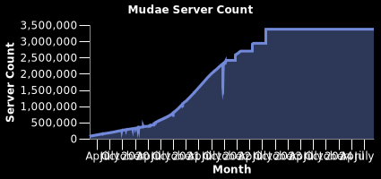

import Highlight from './../../src/components/Hightlight';

# Widgets
:::danger[API Shutting Down]
The DBL Statistics API is shutting down as we move away from DBLStatistics and continue its development at [TopStats.gg](https://topstats.gg)

You can check out the new api at our [docs here](https://docs.topstats.gg) and if you have any questions, you can contact us in our [Discord server](https://topstats.gg/discord)
:::

## Widget <Highlight color="#25c2a0">GET</Highlight>

```
/bot/:id/widget/:type
```

### Available Types

- servers
- totalVotes
- monthlyVotes
- shardCount
- ranks

Query Options:

- ?titleFontSize= - Default: 12
- ?labelFontSize= - Default: 12
- ?backgroundColor= - Default: #00000
- ?textColor= - Default: #FFFFFF
- ?lineColor= - Default: #7289da
- ?width= - Default: 400
- ?height= - Default: 150

Rank Widget Options:

- ?titleColor= - Default: #a8b3dd
- ?rankBackColor= - Default: #1d1e21
- ?rankColor= - Default: #a8b3dd
- ?borderColor= - Default: #a8b3dd69
- ?backgroundColor= - Default: #2a2b2e
- ?width= - Default: 400
- ?height= - Default: 150

### Example Response

```
https://dblstatistics.com/bot/432610292342587392/widget/servers
```


