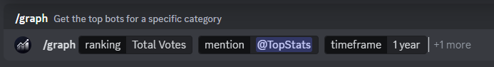

import {Card, TabItem, Tabs, Badge, Aside} from '@astrojs/starlight/components'

<article>
    ## Fetch a Widget

    ```sh
    GET https://widgets.topstats.gg/:id/:statistic?timeframe=:timeframe
    ```

    #### Query Parameters
    ```json
    {
      "id": "<string>",
      "statistic": "<string>" [
        'servers',
        'monthlyvotes',
        'totalvotes',
        'servers.svg',
        'monthlyvotes.svg',
        'totalvotes.svg',
        'servers.png',
        'monthlyvotes.png',
        'totalvotes.png'
      ],
      "timeframe": "<string>" [
      'alltime',
        '5y',
        '3y',
        '1y',
        '270d',
        '180d',
        '90d',
        '30d',
        '7d',
        '3d',
        '1d',
        '12h',
        '6h'
      ],
    }
  ```

  ## Usage Examples

<Tabs>
  <TabItem label="Servers">
    ```sh
    https://widgets.topstats.gg/432610292342587392/servers.png?timeframe=alltime
    ```
    
  </TabItem>
  <TabItem label="Monthly Votes">
    ```sh
    https://widgets.topstats.gg/432610292342587392/monthlyvotes.png?timeframe=alltime
    ```
    
  </TabItem>

  <TabItem label="Total Votes">
    ```sh
    https://widgets.topstats.gg/432610292342587392/totalvotes.png?timeframe=alltime
    ```
    
  </TabItem>
</Tabs>

    ## Discord-Bot
    If you need any help creating your own widgets, then use our [bot's](https://discordapp.com/oauth2/authorize?client_id=583807014896140293&&redirect_uri=https://topstats.gg&auth&response_type=code&scope=bot%20identify) `/graph` command! It'll help you pick all the relevant criterias you'd like.

    

</article>
